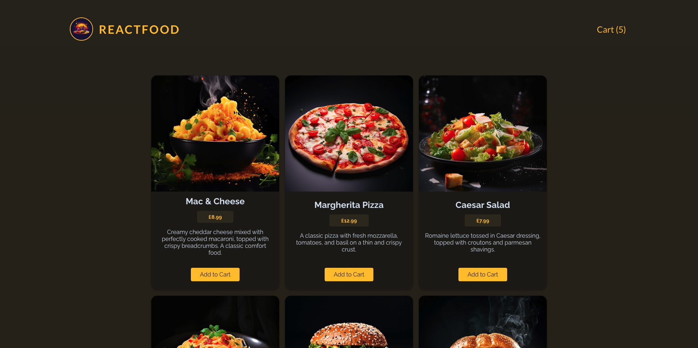

# Food Order App

An application for ordering food that allows users to explore a variety of food items and add them to their shopping cart. Users can easily view and modify the quantity of items in their cart. Upon completing the selection, users will proceed to checkout and then be directed to a form where they can provide personal information for delivery.




## Tech stack

**Frontend:**


**Backend:**


## Quickstart

### Set up your project

1. Fork this repository
2. Clone your fork to your local machine
3. Install Node.js dependencies

   ```bash
   npm install
   cd backend
   npm install
   ```

4. Install an ESLint plugin for your editor. For example: [`linter-eslint`](https://github.com/AtomLinter/linter-eslint) for Atom.

### Start the server

1. Start the server application (in the `backend` directory)

   ```bash
   cd backend
   npm start
   ```

2. Start the front end application (in the `frontend` directory)

   In a new terminal session...

   ```bash
   cd ..
   npm run dev
   ```
